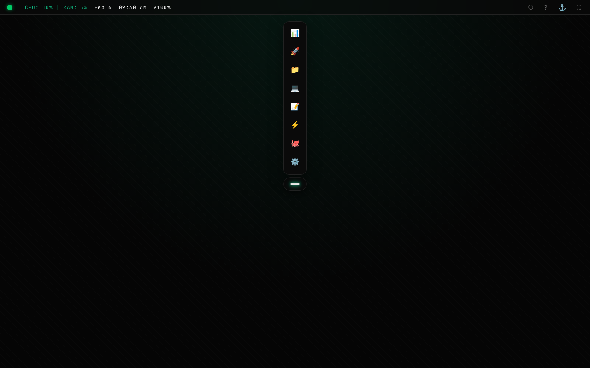
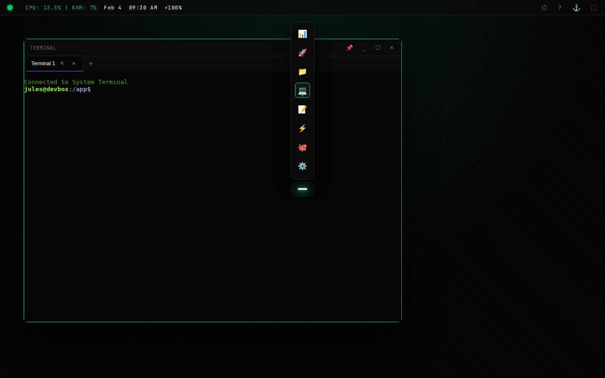
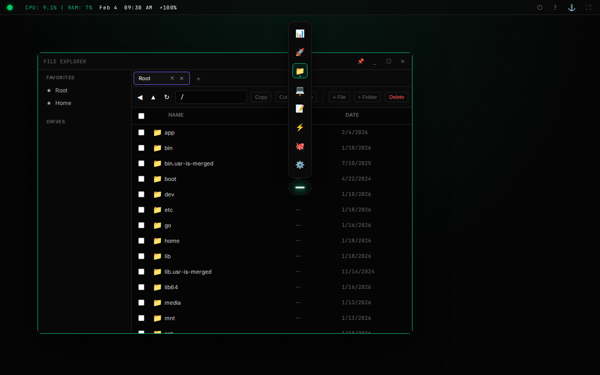
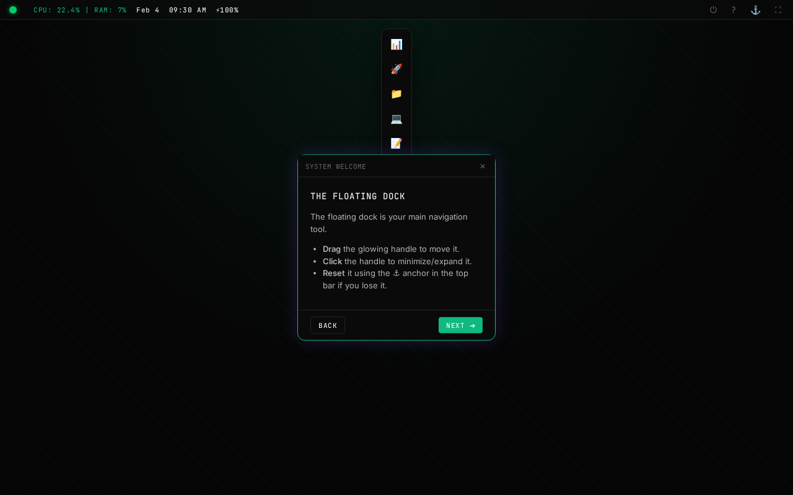

# RemoDash

[](LICENSE)

A visual control plane for headless machines. RemoDash turns a headless machine into a server that serves its GUI, exposing system capabilities through a browser-based dashboard.



## Quick Start

### Linux (Recommended)
RemoDash is optimized for headless Linux systems (servers, SBCs, Homelabs).

```bash
python3 wizard_linux.py
```
*The wizard guides you through dependency installation, security configuration, and setting up a system service.*

### Windows
```cmd
wizard.bat
```

---

## Features

*   **Terminal**: Full-featured terminal emulator (xterm.js) with support for multiple tabs and background processes.
    
*   **File Explorer**: browse, edit, and manage files visually. Supports uploading, downloading, and basic file operations.
    
*   **Shortcuts**: Define one-click actions for scripts (Python, Bash, JS, PowerShell) and executables.
*   **Responsive Design**: Fully functional on mobile devices and tablets.
    
*   **System Stats**: Real-time monitoring of CPU, RAM, and Disk usage.

## Configuration & Security

RemoDash is designed for private networks.

*   **Authentication**: An optional **Admin Token** system restricts access. This can be enabled or disabled via the installation wizard based on your security needs.
*   **Filesystem Security**:
    *   **Open Mode**: Full access to the host filesystem.
    *   **Jailed Mode**: Restricts file operations to a specific root directory (and optional extra roots).
*   **Networking**: We strongly recommend running RemoDash over a secure private network mesh like **Tailscale**, which allows you to access your dashboard securely without opening public ports.

## Limitations

*   **Windows UAC**: The "Run as Admin" feature allows elevated execution of scripts. On Linux, this is handled via `sudo`. On Windows, this triggers a **User Account Control (UAC) prompt on the physical host screen**. Since RemoDash cannot stream this security prompt to the browser, unattended admin execution on Windows is not supported.

## License

This project is licensed under the MIT License - see the [LICENSE](LICENSE) file for details.
